# JEV-CHECK

A small CLI that checks your staged Git changes by asking Jev, the TypeSafe model, yes/no questions about each file. It works like a test suite that a person or a coding agent runs before a commit: `gate: PASS` or `gate: FAIL`.

The author wrote [a note about this project](#a-note-from-the-author) by hand. The rest of this README was generated by AI.

## Quick start

The commands below are for Bash. Each step says where to run it.

### 1. Install jev-check

On Linux or macOS, with Git installed:

```bash
curl -fsSL https://raw.githubusercontent.com/luisferrassini/jev-check/main/install.sh | sh
```

The script downloads the binary for your system from the latest GitHub release, checks its SHA-256, and puts it in `~/.local/bin`. If that folder is not on your `PATH`, it adds one line to your shell's startup file (`~/.bashrc`, `~/.zshrc`, `~/.config/fish/config.fish`, or `~/.profile`) and prints it. Open a new terminal, then:

```bash
jev-check --help
```

The script prints a warning if an older `jev-check`, for example one from `go install`, comes first on your `PATH`. Run it again to update. To choose the folder, set `JEV_CHECK_INSTALL_DIR`. To leave your startup files alone, set `JEV_CHECK_NO_MODIFY_PATH=1`. To pin a release, set `JEV_CHECK_VERSION=v0.1.0`. On other systems, or to build from source with Go 1.26 or newer, run `go install github.com/luisferrassini/jev-check@latest` and add `$(go env GOPATH)/bin` to your `PATH`.

### 2. Make a practice repository

A disposable repository keeps your real projects out of the first run. The path has a space on purpose, to show that quoting works:

```bash
demo="$(mktemp -d)/jev demo"
mkdir -p "$demo" && cd "$demo" && git init -q
jev-check init
```

`init` creates `.jev-check/` and prints each file it made:

| File | What it is |
| --- | --- |
| `.jev-check/project-context.json` | The configuration. Its `checks` list is what the gate runs: at first only `public-release`, at threshold 0.5. |
| `.jev-check/input/questions/*.json` | Every bundled check, one file each: the checks available. jev-check reads checks only from this folder. Edit, delete, or add files here. |
| `.jev-check/README.md` | A short guide to the folder, for whoever maintains it. |
| `.jev-check/.gitignore` | Keeps your key and the saved answers out of Git. |

To turn a check on, add its entry to `checks`. Running `init` again never replaces a file. It creates only the missing ones, and restores only the checks listed in `checks`, so a check you deleted stays deleted. Every jev-check file in a project lives in `.jev-check/`, so deleting that folder removes jev-check.

### 3. Try it without an API key

Still in `"$demo"`, with no key set:

```bash
jev-check list
jev-check ask example --dry-run
```

`list` shows the checks in `.jev-check/input/questions/`: `coding-style`, `example`, `help-text-honesty`, `maintainability`, `no-leftovers`, `public-release`, `secret-handling`, and `test-quality`. `example` has a sample state in `.jev-check/input/states/`, so it needs no `--file`. `ask example --dry-run` prints the request it would send, as JSON with `model`, `questions`, and `state`, and exits 0. Nothing is sent, so this is a preview, not a judgment of the sample script.

### 4. Describe the project

Open `.jev-check/project-context.json` and fill in `purpose` and `rules`, for example:

```json
{
  "purpose": "A practice repository for trying jev-check.",
  "rules": ["Files are short English notes."],
  "folders": {},
  "exclude": [".jev-check/"],
  "checks": [{ "check": "public-release", "threshold": 0.5, "skip": ["LICENSE"] }]
}
```

The `public-release` check asks whether each file can go into a public GitHub repository as it is. It does not judge whether the code works. Its questions are in `.jev-check/input/questions/public-release.json`; edit them there to change what it asks. See [Checks](#checks) for the others.

`.jev-check/.gitignore` keeps the settings file and the saved answers out of Git. `exclude` keeps the whole `.jev-check/` folder out of the tree sent to Jev and out of the gate.

### 5. Add your API key

Get a key at https://console.typesafe.ai/keys. Then, still in `"$demo"`, create `.jev-check/.env` only if it does not exist yet, and put your key after the `=`:

```bash
[ -e .jev-check/.env ] || printf 'TYPESAFE_API_KEY=\n' > .jev-check/.env
```

jev-check reads the key only from this file. It ignores `TYPESAFE_API_KEY` in the environment and your project's own `.env`. See [Configuration](#configuration).

Check the setup before the first paid request:

```bash
jev-check doctor
```

It prints one `ok` or `FAIL` line each for the settings file, the endpoint, the model, the key (`set` or `missing`, never the value), `.jev-check/project-context.json`, and Git and `.jev-check/output/`. It calls no API, so it cannot tell whether the key is valid. Fix any `FAIL` line and run it again until it ends with `doctor: ok`.

### 6. Make your first live request

`ask` and `gate` call the API. `list`, `init`, `context`, `doctor`, and `--dry-run` do not.

Still in `"$demo"`:

```bash
jev-check ask example
```

It prints one line per question, with the probability that the sample script is fine on that axis. For example:

```
      0.2  clear_names
      0.04  handles_missing_file
model: jev-1.13.0  saved: <demo>/.jev-check/output/<timestamp>-example-<random>.json
```

The sample has two deliberate flaws, so low numbers are expected. Your numbers will differ from run to run. Without `--threshold`, `ask` exits 0 even when the numbers are low. Each request and response is saved in `./.jev-check/output/`.

### 7. Gate a staged change

Still in `"$demo"`, write a file, stage it, and look at what the gate will see:

```bash
printf '%s\n' '# Hello' '' 'A tiny sample project for trying jev-check.' > README.md
git add -- README.md
git diff --cached          # the patch that is sent
jev-check context .        # the project fields and file tree sent with it
jev-check gate .
```

The gate sends one patch per staged file to every check in `.jev-check/project-context.json`, together with `purpose`, `rules`, `folders`, and the file tree. A patch includes its context and removed lines. Output looks like this (your numbers will differ):

```
== public-release README.md
ok    0.81  belongs_in_project
ok    0.96  english_only
ok    0.98  no_outside_paths
ok    0.98  no_personal_info
ok    0.98  no_private_links
ok    0.98  no_third_party_content
gate: PASS
```

The gate reads the staged version of each file. After you edit a file, run `git add -- <file>` again, or the gate judges the old version. When nothing in the request changed in the last 24 hours, the file shows `(cached)` and costs no new request. See [Cache](#cache).

### 8. Read the result

| Output | Exit | Meaning | What to do |
| --- | --- | --- | --- |
| `gate: PASS` | 0 | Every answer met its threshold. | Nothing. It is a judgment on these patches, not proof that the code works. |
| `nothing staged` | 0 | No file was judged. | Stage the files you want checked with `git add -- <file>`. |
| `FAIL <probability> <question>`, then `gate: FAIL` | 1 | That file failed that question. | Fix the file, stage it again, and rerun. |
| `SECRET <location> line N looks like <kind>` | 1 | Something looked like a secret, so that request was never sent. | Remove the value. See [Secret scan](#secret-scan). |
| `jev-check <command>: ...` on stderr, and `gate: ERROR` when the gate had started | 2 | A usage, setup, or API error. It is not a judgment. | Read the message. See [Troubleshooting](#troubleshooting). |

### 9. Use it on your project

Go to your project's root folder and repeat steps 2 to 7 there, without the `mktemp` and `git init` lines. In step 7, skip the `printf` line, which would overwrite your `README.md`. Stage one of your own changed files instead, with `git add -- <file>`. If the project already has a `.jev-check/project-context.json`, `init` keeps it and every other existing file, and creates only what is missing. Commit `.jev-check/` so everyone uses the same checks; its `.gitignore` keeps the key and the answers out.

A project set up by an older version has no `.jev-check/input/`, because those versions ran the bundled checks from inside the binary. Now `gate` exits 2 with `no check "public-release": .../input/questions/public-release.json does not exist`. Run `jev-check init` once in the project root. It copies each bundled check that `checks` names and writes `.jev-check/README.md`. Then commit the new files. If the project has a `project-context.json` at its root from an older version, see [Moving to `.jev-check/`](#moving-to-jev-check). To let a coding agent run the gate, see [Use it from an agent](#use-it-from-an-agent).

## Troubleshooting

| Symptom | Fix |
| --- | --- |
| `go: command not found` or `git: command not found` | Install Go 1.26 or newer, or Git, and open a new terminal. |
| `jev-check: command not found` | Open a new terminal after the install script. If it still fails, add the folder the script printed (default `~/.local/bin`) to your `PATH`. |
| `jev-check` runs an old version | Run `command -v jev-check`. If it is not in `~/.local/bin`, delete that older binary, which is often in `$(go env GOPATH)/bin`. |
| `no check "<name>": .../input/questions/<name>.json does not exist` | The project does not have that check. For a check in `checks`, run `jev-check init`. For any bundled check, run `jev-check add <name>`. |
| `open .../.jev-check/project-context.json: no such file or directory` | You are not in the project folder, or it has no configuration yet. `cd` into the project, or pass it as `jev-check gate <project>`, and run `jev-check init` if needed. There is no search in parent folders. |
| `.../project-context.json is no longer read` | The project uses the old layout. Move the files as in [Moving to `.jev-check/`](#moving-to-jev-check). |
| `fatal: not a git repository` or `... is not in a git working tree` | Run `git init` in the project, or point at the right folder. |
| `set TYPESAFE_API_KEY in .../.jev-check/.env` | Add the key as in step 5. A key in the environment or in the project's `.env` is ignored. |
| `.../.jev-check/.env is tracked by Git` | Run `git rm --cached -- .jev-check/.env` and add `.env` to `.jev-check/.gitignore`. jev-check refuses a settings file that a repository ships. |
| `JEV_CHECK_ENDPOINT in .../.jev-check/.env must ...` | Fix the endpoint as the message says. See [Configuration](#configuration). |
| `API call failed: 307 Temporary Redirect` or another 3xx | The endpoint redirects. jev-check does not follow redirects, so set `JEV_CHECK_ENDPOINT` to the final URL. |
| `API call failed: 401 Unauthorized` | The key is wrong or revoked. Check it in the key console. |
| `API call failed: ...` with another status or a network error | The service or the network failed. It is exit 2, not a rejected change. Try again later. |
| `invalid JSON in .../project-context.json` or `check ... needs a threshold from 0 to 1` | Fix the configuration. [Gate](#gate) describes every field. |
| `nothing staged` | Stage the files with `git add -- <file>`. |
| A `SECRET` line | Remove the value from the file or the configuration. There is no bypass. |
| `mkdir .../.jev-check/output: permission denied` | `.jev-check/` must be writable. `ask` and `gate` save answers and the cache in `.jev-check/output/`. |

`jev-check doctor [DIR]` checks most of these at once without calling the API.

## A note from the author

Hello there! I am a human. Are you?

This repo is an wild idea I had to make use of [Jev](https://typesafe.ai/) kinda like a local CI. But there are some things to consider:

### 1. Have fun
- Explore, make better question checks, etc..
- Let me know while you are at it. 
- Just don't throw AI slop at me please, take a breath before submiting any request. :D

### 2. You don't have to use the "Jev"
- You can just point the URL at an opensource Jev alternative (I tried [kev](https://github.com/jaredpalmer/kev)) and this tool should work the same way, but don't expect high quality results if you don't know what you are doing (like myself over which is best).
- I think that a nice idea for the future of Development is that the harnesses and skills will have now a local classifier to unburden the servers with some low-risk decisions. I just don't know how to build that. Take my idea and implement it, just credit me later if you can! XD

> Note from the maintainers, not part of the author's text: set `JEV_CHECK_ENDPOINT` in `.jev-check/.env` to use another service. See [Configuration](#configuration). Other providers are untested.

### 3. This was kinda vibecoded
- I don't know too much about the `go` language, my agent just said that it would be better than bash scripts so I went with it. I do have a degree in Computer Science but please, let me know if I made mistakes and how to improve this.
- Use at your own risk! You were warned.

There is so much AI slop everywhere so I made sure to write at least this section. I plan to eventually write all of this by hand, but this is what I got for you for now.

## Where things live

Everything jev-check reads or writes is in the `.jev-check/` folder of the project you run it in. Nothing is read from the project root or from beside the binary. The binary carries copies of the bundled checks, but only as templates: `init` and `add` copy them into the project, and `ask`, `gate`, and `eval` run only the project's copies.

| Item | Location |
| --- | --- |
| Project configuration | `<project>/.jev-check/project-context.json` (`jev-check init` creates one) |
| Checks and default states | `<project>/.jev-check/input/questions/` and `<project>/.jev-check/input/states/` (`jev-check add <check>` copies a bundled one) |
| A guide to the folder | `<project>/.jev-check/README.md` (`jev-check init` writes it) |
| API key, endpoint, and model | `<project>/.jev-check/.env`; see [Configuration](#configuration) |
| Saved requests and responses | `<project>/.jev-check/output/` |
| Gate and eval cache | `<project>/.jev-check/output/cache/v2/` |
| Fixtures | `<project>/.jev-check/fixtures/<check>/` |

Paths inside the configuration (`exclude`, `skip`, `folders`, `coding_style`) stay relative to `<project>`, not to `.jev-check/`.

`gate`, `eval`, `context`, `doctor`, `init`, and `list` take the project folder as `DIR`, and `add` takes it as `--dir DIR` (default: the current folder). `ask` uses the current folder. There is no search in parent folders.

For development, `go build -o jev-check .` still works. This repository ignores its own `.jev-check/`. It tracks its configuration, the bundled checks, their fixtures, and the folder guide in `.jev-check-example/`, and the binary embeds the checks and the guide from there. To work on it, link them into `.jev-check/` once, so edits to a check apply here without a rebuild:

```bash
mkdir -p .jev-check && ln -s ../.jev-check-example/project-context.json ../.jev-check-example/input ../.jev-check-example/fixtures .jev-check/
```

Other projects keep their own copies, so a change to a bundled check reaches them only through a rebuild and `jev-check add` (see `.jev-check/README.md` in any project).

### Moving to `.jev-check/`

Older versions read `project-context.json`, `input/`, and `fixtures/` from the project root and wrote `output/` there. Now `gate`, `eval`, and `context` exit 2 when they find only a root `project-context.json`, and `doctor` reports one. Nothing is moved for you. From the project root:

```bash
mkdir -p .jev-check
git mv project-context.json .jev-check/
git mv input .jev-check/        # only jev-check checks, if any
git mv fixtures .jev-check/     # if any
printf '%s\n' .env output/ > .jev-check/.gitignore   # if you did not run init
```

Then check `exclude`: the old entries `output/` and `fixtures/` no longer match; `.jev-check/` covers them. The old `output/` can be deleted. Saved answers in it stay readable by `jev-check judge <path>`. Old cache files are not imported, so the first gate calls the API for every file.

### Upgrading from the binary-folder layout

Older versions read `input/`, `.env`, and `output/` from the binary's folder. To move a project over:

1. Copy your custom `input/questions/<name>.json` files, and any matching `input/states/<name>.json`, into the project's `.jev-check/input/`.
2. Put `TYPESAFE_API_KEY=<key>` in the project's `.jev-check/.env`, and keep `.env` in `.jev-check/.gitignore`. The environment variable and the project's `.env` are no longer read. From a project that had the key in `.env`: `mkdir -p .jev-check && grep '^TYPESAFE_API_KEY=' .env > .jev-check/.env`. Run `jev-check doctor` to check.
3. Expect new answers in the project's `.jev-check/output/`. Old saved answers still work with `jev-check judge <path>`. The old cache is not read.
4. The cache is in `.jev-check/output/cache/v2/` with a new key, so the first gate after upgrading calls the API for every file. Older cache entries are never read. Delete them to reclaim space.

## Use it from an agent

[`skills/jev-check/SKILL.md`](skills/jev-check/SKILL.md) is the one source of the agent skill. It tells an agent to stage only its own changes, run `jev-check gate <project>`, act on each result, and stop after three runs. Install the `jev-check` binary first (see [Install jev-check](#1-install-jev-check)): the skill uses the one on `PATH`, or a path you give the agent.

Copy the skill into the project where the agent works. Pick the folder your agent reads project skills from:

| Agent | Destination in your project | Check |
| --- | --- | --- |
| Claude Code | `.claude/skills/jev-check/SKILL.md` | The agent lists a `jev-check` skill. |
| Codex | `.agents/skills/jev-check/SKILL.md` | The Codex session lists the skill. Tested with one Codex setup, not every version. |
| Other | The project skill folder its documentation names | There is no universal folder, so check that agent's documentation. |

Run this from the root of your project, with `src` pointing at this repository's copy (Bash):

```bash
src='<jev-check checkout>/skills/jev-check/SKILL.md'
dst='.claude/skills/jev-check/SKILL.md'
if [ -e "$dst" ]; then diff -u "$dst" "$src"; else mkdir -p "$(dirname "$dst")" && cp "$src" "$dst"; fi
```

For Codex, set `dst='.agents/skills/jev-check/SKILL.md'` instead.

It never replaces an existing skill. It shows the difference instead, so you can keep your changes or replace the file yourself. Check that the agent sees the skill in its own skill list.

## Configuration

jev-check reads its settings from `<project>/.jev-check/.env`, and from nothing else. `<project>` is `DIR` for `gate`, `eval`, and `doctor`, and the current folder for `ask`. Each line is `NAME=value`. The value is trimmed, the first nonempty line for a name wins, and other lines are ignored. There is no quoting and no `export`.

| Name | Meaning | Default |
| --- | --- | --- |
| `TYPESAFE_API_KEY` | The API key. `ask`, `gate`, and `eval` exit 2 without one when they need to call the API. | none |
| `JEV_CHECK_ENDPOINT` | The URL that every request is posted to, with the key. | `https://api.typesafe.ai/v1/systemone` |
| `JEV_CHECK_MODEL` | The model for `ask`, `gate`, and `eval`. `--model ID` on those commands wins over it. `--model ""` is an error. | `jev-latest` |

```bash
# .jev-check/.env
TYPESAFE_API_KEY=<your key>
JEV_CHECK_MODEL=<a pinned model ID>
```

- Environment variables are not read, and neither is the project's own `.env`, so jev-check never shares your application's secrets file.
- If Git tracks `.jev-check/.env`, every command that reads it exits 2 and sends nothing. A cloned repository cannot choose where your key goes. Keep `.env` in `.jev-check/.gitignore`. Outside a Git work tree, as `ask` allows, this check is skipped.
- The key is sent to whatever endpoint is set. The endpoint must be an absolute URL with a host, with no user name, password, or `#fragment`. `https` works for any host. `http` works only for `localhost`, `127.0.0.0/8`, and `::1`. Any other value is exit 2 before any request, including `ask --dry-run`.
- Redirects are not followed. A 3xx response is an API error, exit 2, so the key never goes to the redirect target.
- `ask --dry-run` prints the request with the resolved model.
- `jev-check doctor [DIR]` prints the settings file, the endpoint and model with their sources, whether the key is set, and whether `.jev-check/project-context.json`, Git, and `.jev-check/output/` are usable, and reports a root `project-context.json` from the old layout. It exits 0 when every line is `ok`, 1 when the model looks like a secret, and 2 on any other problem. It never calls the API or prints the key.

## Gate

```bash
git add -- app.py notes.md   # stage the files you want judged
jev-check gate .              # one patch per staged file, to every check in .jev-check/project-context.json
jev-check gate . --no-cache   # same, but call the API for every file
```

```
== public-release notes.md
ok    0.97  no_personal_info
FAIL  0.12  english_only
...
gate: FAIL
```

Each answer is the probability that the file is fine on that axis. A file fails when any answer is below the check's threshold. Missing or invalid answers are errors, including answers loaded from cache. Exit codes: `0` pass, `1` fail or a secret found, `2` usage or API error.

### Secret scan

Before a request is printed, cached, saved, or sent, a local scan checks all of it: the model, the questions, the project fields, the tree, file names, and every patch line, including removed and context lines. JSON escapes are decoded first, and each key and value is also checked as a pair, so a value that looks harmless alone is caught next to a key such as `password`. A finding prints `SECRET <location> line N looks like <kind>`, never the value, and exits `1`:

- In `gate`, a secret in the project fields or tree stops the whole gate. One in a check's questions skips that check. One in a patch skips that file, and the other files still run.
- `eval` scans every fixture before it sends any.
- `ask` and `ask --dry-run` print the findings instead of the request.

The scan matches known patterns, such as provider token formats, private key headers, and credentials in URLs. It cannot recognize every secret. There is no bypass flag: remove or replace the value.

The gate reads `.jev-check/project-context.json` in the project folder:

<!-- canonical-config: TestShippedConfigs gates a repository with this block -->
```json
{
  "purpose": "One or two sentences on what the project is and who runs it.",
  "rules": ["Short project rules Jev should judge against."],
  "folders": { "src": "What lives in each folder." },
  "exclude": [".jev-check/"],
  "checks": [{ "check": "public-release", "threshold": 0.5, "skip": ["LICENSE"] }]
}
```

- `purpose`, `rules`, `folders`, and the file tree go to Jev with every patch. Keep them short: a large state dilutes answers.
- `exclude` and `skip` are git pathspecs, relative to the project folder. `exclude` is never listed or sent. With `.jev-check/` excluded, as `init` sets it, edits to your own checks are not gated; remove that entry to gate them, and exclude `.jev-check/fixtures/` instead. `skip` is ignored by that one check.
- `per_question` sets a threshold for one question, overriding the check's default.

### Cache

`gate` and `eval` cache answers in `<project>/.jev-check/output/cache/v2/`. The key is the endpoint and the whole request: the model you asked for, the questions, and the full state (project fields, tree, patch, and `coding_style`). Any change to them misses the cache and costs a new request. Adding, removing, or renaming any file changes the tree, so the next gate sends every staged file again. Thresholds are not in the key: after a threshold change, the gate judges the cached answers again with no new request.

- An entry is reused for less than 24 hours after its answer arrived. Reading it does not renew it, and neither does touching the file. A model name such as `jev-latest` can point at a new model within those 24 hours; the limit bounds that, it does not prevent it. The same request can also get different answers on different runs.
- `--no-cache` always calls the API and replaces the entry when the call succeeds.
- A damaged, expired, or older-format entry is a miss. When the call then fails, the command fails with exit 2; it never falls back to an old answer.
- If the cache cannot be written, the command warns on stderr and keeps the live answer.
- Keep `output/` in `.jev-check/.gitignore`. Answers saved there are otherwise part of the tree, and every run misses the cache.
- Deleting `.jev-check/output/cache/` only costs new requests. It never removes configuration.

## Checks

`public-release`: can this file go into a public GitHub repository as it is? It asks about personal information, paths outside the repository, private links, non-English text, copied third-party content, and files that belong to another project. This repository gates itself on it.

In this repository, `eval` measures it against `.jev-check-example/fixtures/public-release/`:

```
$ jev-check eval public-release
positive  negative  question
9         2         belongs_in_project
9         2         english_only
9         2         no_outside_paths
9         2         no_personal_info
9         2         no_private_links
9         2         no_third_party_content
lowest-pass  highest-fail  threshold  question
0.83         0.2           0.5        belongs_in_project
0.88         0.13          0.5        english_only
0.87         0.1           0.5        no_outside_paths
0.93         0.02          0.5        no_personal_info
0.92         0.02          0.5        no_private_links
0.91         0.22          0.5        no_third_party_content
eval: 0 misses in 21 fixtures
```

In this run with `jev-latest` on 2026-09-26, every clean fixture scored 0.83 or more and every problem scored 0.22 or less, so a threshold of 0.5 separates them with a wide margin on both sides. Scores vary between runs. A question that could not separate its fixtures was removed.

`jev-check init` copies every bundled check into `.jev-check/input/questions/`, but the gate runs only the checks in `checks`. An opt-in check runs once you add its entry, as each check below shows, to `checks`. If you deleted its file, `jev-check add <check>` copies it again.

`coding-style` is opt-in. It judges added or changed code against two rules in a project document: `clear_names` and `actionable_errors`. See [Coding style](#coding-style).

`maintainability` is opt-in and covers Go source only. It makes two narrow judgments about new code in one patch:

- `no_redundant_forwarding`: no new local closure that only forwards one call, is called once, and adds nothing. Top-level functions, exported or documented operations, adapters passed as callbacks, helpers called more than once, test helpers, and helpers that branch, change arguments or results, or manage a resource are accepted. So is a closure in a hunk that does not show the whole enclosing function.
- `no_mixed_output_channels`: no new progress or debug prose on the same stream as machine-readable data, where the patch shows that the stream holds only data. Diagnostics on stderr, output meant for people, separate modes, help text, and status inside the data schema are accepted.

It judges only what added or changed lines show. Removed code, deletion-only patches, untouched context, non-Go files, documentation, and visible generated files pass. A file counts as generated only when its visible first lines carry the standard `// Code generated ... DO NOT EDIT.` header, not from its name alone. A pass does not mean the project is maintainable. To enable it, add `{ "check": "maintainability", "threshold": 0.49 }` to `checks`. The threshold and the scores behind it are in [`.jev-check-example/fixtures/maintainability/CALIBRATION.md`](.jev-check-example/fixtures/maintainability/CALIBRATION.md). To evaluate it, use the disposable project from [Evaluating an opt-in check](#evaluating-an-opt-in-check) with `.jev-check-example/fixtures/maintainability`, no `CODING_STYLE.md`, and `{"check":"maintainability","threshold":0.49}`.

`no-leftovers` is opt-in and covers any language. It makes four narrow judgments about lines added in one patch:

- `no_debug_prints`: no new print that dumps values or trace markers for the developer. Logger calls and output that is the program's job, such as CLI or script output, are accepted.
- `no_commented_out_code`: no new comment that holds statements that would run without the comment markers. Prose comments, doc-comment examples, and license headers are accepted.
- `no_bare_todos`: no new TODO, FIXME, XXX, or HACK without an issue, an owner, or a specific next step.
- `no_temporary_skips`: no new unconditional test skip without a tracking issue, and no focus marker such as `it.only` or `fit`. A skip behind a condition, with a reason, is accepted.

Removed leftovers, untouched context, and documentation files pass. To enable it, add `{ "check": "no-leftovers", "threshold": 0.41 }` to `checks`. The scores behind the threshold are in [`.jev-check-example/fixtures/no-leftovers/CALIBRATION.md`](.jev-check-example/fixtures/no-leftovers/CALIBRATION.md). To evaluate it, use the disposable project from [Evaluating an opt-in check](#evaluating-an-opt-in-check) with `.jev-check-example/fixtures/no-leftovers`, no `CODING_STYLE.md`, and `{"check":"no-leftovers","threshold":0.41}`.

`test-quality` is opt-in and covers Go test files (`*_test.go`) only. It makes three narrow judgments about new test code in one patch:

- `tests_use_entry_point`: no new test checks an unexported internal function directly. `run`, `main`, exported APIs, HTTP handlers, and test helpers are accepted.
- `no_sleep_or_network`: no new `time.Sleep` and no call to a real network host. `httptest`, loopback listeners, `t.TempDir`, and a `time.After` timeout guard are accepted.
- `failures_name_what_failed`: every new failure report names the case, input, or value that failed. `t.Fatal(err)` is accepted.

Removed code, untouched context, non-test files, and documentation pass. The check sees one file, so it cannot tell whether a lowercase function is a helper in another test file. To enable it, add `{ "check": "test-quality", "threshold": 0.45 }` to `checks`. The scores behind the threshold are in [`.jev-check-example/fixtures/test-quality/CALIBRATION.md`](.jev-check-example/fixtures/test-quality/CALIBRATION.md). To evaluate it, use the disposable project from [Evaluating an opt-in check](#evaluating-an-opt-in-check) with `.jev-check-example/fixtures/test-quality`, no `CODING_STYLE.md`, and `{"check":"test-quality","threshold":0.45}`.

`secret-handling` is opt-in and covers any language. It makes two judgments about new code in one patch:

- `no_logged_credentials`: no new code writes a credential's value to a log, the console, an error message, or a dump of an object or headers. Logging only its length, whether it is set, its name or header name, or a masked form is accepted.
- `no_unvalidated_destination`: no new code sends a credential to a URL that the patch shows comes from outside the code, such as an environment variable, a flag, a config file, or a response, with no visible scheme or host check. Constant https URLs, loopback http, URLs checked before the send, validated config types, and parameters whose origin the patch does not show are accepted.

It finds credentials by name and use, not by value, so it does not replace the [secret scan](#secret-scan). To enable it, add `{ "check": "secret-handling", "threshold": 0.5 }` to `checks`. The scores behind the threshold are in [`.jev-check-example/fixtures/secret-handling/CALIBRATION.md`](.jev-check-example/fixtures/secret-handling/CALIBRATION.md). To evaluate it, use the disposable project from [Evaluating an opt-in check](#evaluating-an-opt-in-check) with `.jev-check-example/fixtures/secret-handling`, no `CODING_STYLE.md`, and `{"check":"secret-handling","threshold":0.5}`.

`help-text-honesty` is opt-in. It makes two judgments about usage and help text in one patch:

- `help_flags_exist`: every flag the text names is handled in the same file.
- `help_behavior_matches`: every default, exit status, or mode behavior the text claims matches the code.

It fails only when the patch itself shows the mismatch, such as a whole argument parser with no such flag. When the parser or the code is not visible, the file passes, and so do documentation and files with no help text. A pass does not mean the help is complete. To enable it, add `{ "check": "help-text-honesty", "threshold": 0.47 }` to `checks`. The scores behind the threshold are in [`.jev-check-example/fixtures/help-text-honesty/CALIBRATION.md`](.jev-check-example/fixtures/help-text-honesty/CALIBRATION.md). To evaluate it, use the disposable project from [Evaluating an opt-in check](#evaluating-an-opt-in-check) with `.jev-check-example/fixtures/help-text-honesty`, no `CODING_STYLE.md`, and `{"check":"help-text-honesty","threshold":0.47}`.

`example` is a first check to try. Its default state, `.jev-check/input/states/example.json`, holds a sample script, so it needs no `--file`.

## Coding style

Keep detailed coding rules in one document, and give it to the checks that need it with `coding_style`:

```json
{
  "checks": [
    { "check": "public-release", "threshold": 0.5 },
    { "check": "coding-style", "threshold": 0.5, "coding_style": "CODING_STYLE.md" }
  ]
}
```

- `coding_style` names one file, relative to the project folder. Only that check's requests get it, as `state.coding_style` with `path` and `content`. Other checks do not.
- The file is read from the working tree, like `.jev-check/project-context.json`. Unstaged edits apply at once, and an untracked file works. A file that is deleted in the working tree fails, even if git still has a copy. The patches under review are still the staged ones. Commit the rules with the change that needs them.
- The file is sent even when `exclude` or `skip` lists it. Those select the files to judge, not the context.
- The path must stay inside the project, without `..`, absolute paths, or symlinks. The file must be regular UTF-8 text, not empty, with no NUL byte, and at most 65,536 bytes. It is sent exactly as it is. Any problem is exit `2` before any request.
- A change to the document misses the cache for the checks that use it. A threshold change does not.
- `jev-check context` adds `coding_styles`, each path once with its contents. It is a preview of all documents, not the exact request of any one check.

This repository's rules are in [`CODING_STYLE.md`](CODING_STYLE.md). Formatting (`gofmt`), `go vet`, and `go test` stay with those tools; the check does not guess whether they ran. A pass from `coding-style` is a judgment over one patch, not proof that the repository follows the rules. It is not in this repository's gate yet. Its calibration is in [`.jev-check-example/fixtures/coding-style/CALIBRATION.md`](.jev-check-example/fixtures/coding-style/CALIBRATION.md).

### Evaluating an opt-in check

`eval` needs the check in the project's configuration. To evaluate an opt-in check without changing this repository's gate, copy its fixtures into a disposable project (Bash):

```bash
tmp="$(mktemp -d)"
git -C "$tmp" init -q
mkdir -p "$tmp/.jev-check/fixtures"
cp -R .jev-check-example/fixtures/coding-style "$tmp/.jev-check/fixtures/"
cp CODING_STYLE.md "$tmp/"
jev-check add --dir "$tmp" coding-style
printf '%s\n' '{"exclude":[".jev-check/"],"checks":[{"check":"coding-style","threshold":0.5,"coding_style":"CODING_STYLE.md"}]}' > "$tmp/.jev-check/project-context.json"
cp .jev-check/.env "$tmp/.jev-check/"   # the key
jev-check eval coding-style "$tmp" --no-cache
```

## Fixtures and eval

```
.jev-check/fixtures/<check>/pass/<file>.patch              must pass every yes/no question
.jev-check/fixtures/<check>/fail/<question>/<file>.patch   must fail that question
```

`jev-check eval <check>` needs at least one pass fixture, and at least one fail fixture for every yes/no (`noul`) question. A fail folder must name a yes/no question. Files that do not end in `.patch`, such as notes, are ignored. Before anything is sent, `eval` reads, parses, and scans every fixture, so a missing set or a bad fixture costs no API call.

A probability at or above the threshold passes, as in the gate. A pass fixture counts one miss per question below its threshold. A fail fixture counts a miss only for its own question.

Each fixture is one single-file patch from git. Make one by staging the file at its real path and running `git diff --cached --relative -- <file>`. `eval` sends it under the path in its headers: the new path, the old path of a deleted file, or the `rename to` path of a pure rename. Quoted paths, spaces, and non-ASCII names work. Binary, mode-only, and multi-file patches are refused, and a lone `+++ b/<path>` line is not a fixture.

The coverage counts show that the suite is complete, not that the model is accurate. Only a live `eval` run shows how the current model scores the fixtures.

## Contributing code

You need Go (the version in `go.mod`) and `git`. No API key: every test uses a fake Jev server. Run these from the repository root, in this order:

```bash
git ls-files -z '*.go' | xargs -0 gofmt -l   # prints files that need formatting; fix them with gofmt -w <file>
go vet ./...
go test -count=1 ./...
go build -o jev-check .
[ -e .jev-check/project-context.json ] || (mkdir -p .jev-check && ln -s ../.jev-check-example/project-context.json ../.jev-check-example/input ../.jev-check-example/fixtures .jev-check/)
./jev-check --help && ./jev-check list && ./jev-check ask example --dry-run && ./jev-check context .
```

The same commands run on every pull request and every push to `main`, as the GitHub check `CI / checks` ([`.github/workflows/ci.yml`](.github/workflows/ci.yml)). It needs no secrets, so it works on pull requests from forks. Making it a required check is a branch protection setting, not part of the repository.

CI never calls the real API. `jev-check eval <check>` does: it needs the key in `.jev-check/.env`, and each run costs API usage. Run it by hand when you change a question or its fixtures, and put its output in the pull request.

## Contributing a better question

Found a file the gate gets wrong, or a better way to ask? Open a pull request with:

1. The fixture that shows the problem: a clean file that fails, or a problem that passes.
2. The new or reworded question in `.jev-check-example/input/questions/<check>.json`.
3. The `jev-check eval <check>` output, with `0 misses`.

New checks are welcome on the same terms: a question file, fixtures on both sides, and the eval output.

## System diagram

jev-check is one binary with ten commands. Every command reads and writes only inside `<project>/.jev-check/`, runs `git` for the tree and the staged patches, and sends requests to one endpoint. Every request passes the local secret scan before it is printed, cached, saved, or sent.

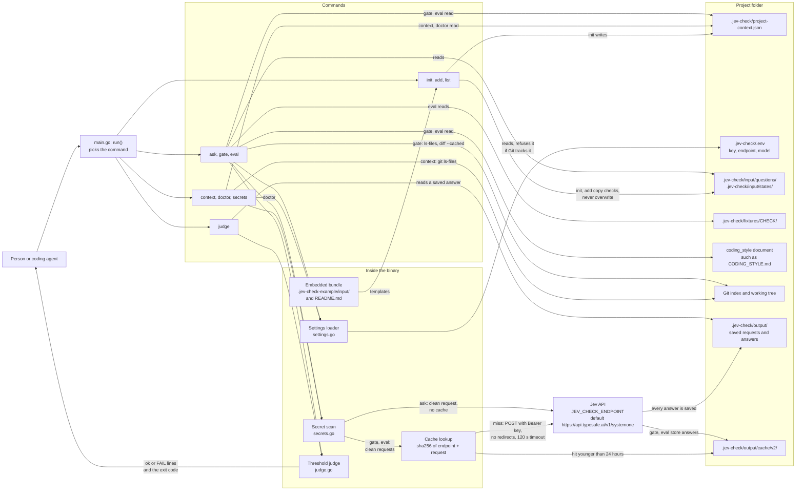

The pieces, from the request's point of view:

1. `settings.go` reads `.jev-check/.env`. It refuses the file when Git tracks it, checks the endpoint (https, or http on loopback only), and picks the model: `--model`, then `JEV_CHECK_MODEL`, then `jev-latest`.
2. `context.go` reads `.jev-check/project-context.json` and lists the file tree with `git ls-files`, minus `exclude`. This is the shared part of every gate and eval request.
3. `ask.go` reads a check from `.jev-check/input/questions/<name>.json`, and its optional default state from `.jev-check/input/states/<name>.json`. It also holds `callJev`, the only function that sends a request.
4. `secrets.go` scans the whole request. `callJev` and `cachedJev` scan again before they act, so no path to the API skips the scan.
5. `gate.go` holds the cache. The key is the SHA-256 of the cache version, the endpoint, and the whole request. An entry is reused for less than 24 hours.
6. `judge.go` compares each yes/no (`noul`) answer with its threshold and prints `ok` or `FAIL`. Choice and score answers print as `info` and never fail.

Every command runs through the same dispatcher in `main.go`:

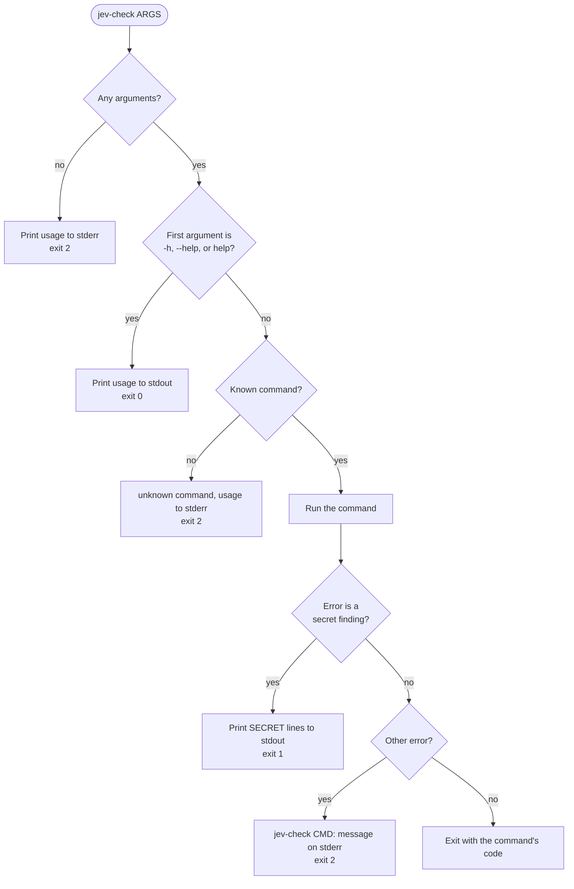

## Commands

```bash
jev-check init [DIR]                             # create DIR/.jev-check/, or restore its missing files
jev-check add [--dir DIR] <check>...             # copy bundled checks into DIR/.jev-check/input/
jev-check list [DIR]                             # the project's checks and which ones the gate runs
jev-check ask <check> --file PATH --threshold N  # ask one check about any files
jev-check ask draft.json --file PATH --dry-run   # print the request for a draft check
jev-check context .                              # the project state Jev sees
jev-check secrets PATCH...                       # the local secret scan alone
jev-check judge .jev-check/output/<file>.json 0.5 # judge a saved answer again, without the API
jev-check gate [DIR]                             # run DIR's checks on its staged files
jev-check eval <check> [DIR]                     # test a check's thresholds on its fixtures
jev-check doctor [DIR]                           # the settings and setup problems, without the API
jev-check <command> --help
```

| Command | Calls the API | Reads `.jev-check/.env` | Needs Git | Writes files |
| --- | --- | --- | --- | --- |
| `init` | no | no | yes | `.jev-check/` files that are missing |
| `add` | no | no | no | `.jev-check/input/` files that are missing |
| `list` | no | no | no | nothing |
| `ask` | yes, not with `--dry-run` | yes | no | `.jev-check/output/` |
| `context` | no | no | yes | nothing |
| `secrets` | no | no | no | nothing |
| `judge` | no | no | no | nothing |
| `gate` | yes, on a cache miss | yes | yes | `.jev-check/output/` and its cache |
| `eval` | yes, on a cache miss | yes | yes | `.jev-check/output/` and its cache |
| `doctor` | no | yes | yes | a probe file it deletes at once |

Every command prints its own help with `--help`, and exits 2 on arguments it cannot use.

### init

`jev-check init [DIR]` sets up `DIR/.jev-check/` (default: the current folder). It never replaces a file, so running it again restores only what is missing. It reads no settings and calls no API.

1. Makes `DIR` absolute. `DIR` must be a folder inside a Git working tree (`git rev-parse --is-inside-work-tree`), or it exits 2.
2. Creates `DIR/.jev-check/` with a plain `mkdir`. An existing folder is fine. A file or symlink named `.jev-check` is an error.
3. Creates `project-context.json` with the default configuration (`public-release` at threshold 0.5, `exclude: [".jev-check/"]`). If the file exists, it prints `kept` and reads it instead. If the file cannot be created and this run made `.jev-check/`, it removes that folder again.
4. Creates `.gitignore` with `.env` and `output/`, and `README.md` from the bundle. Each is `created` or `kept`.
5. Copies checks into `input/`, the same way `add` does. When `input/questions/` does not exist yet, it copies every bundled check: these are the checks available. When the folder exists, it copies only the bundled checks that `checks` names, so a check you deleted stays deleted. The gate runs only the checks listed in `checks`.
6. Prints five next steps: review the config and its `checks`, add the key, run `doctor`, stage work, run `gate`.

Exit 0 on success, 2 on any error, including invalid JSON in an existing `project-context.json`.

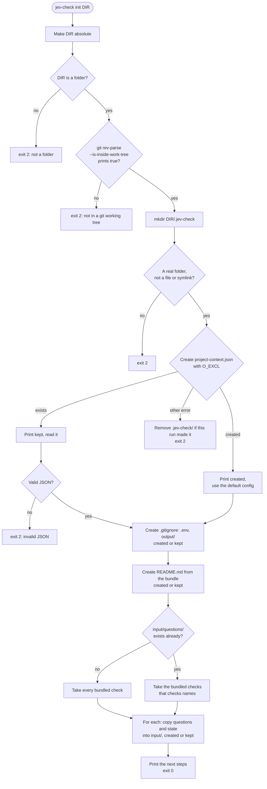

### add

`jev-check add [--dir DIR] <check>...` copies bundled checks into `DIR/.jev-check/input/` (default `DIR`: the current folder). `ask`, `gate`, and `eval` run only these copies, so you edit a check there. It does not need Git or settings.

1. Reads `--dir DIR` and one or more check names. No names is exit 2.
2. `DIR` must be a folder.
3. Checks every name before it writes anything. A name must use only letters, digits, `-`, and `_`, and must be a bundled check. One bad name is exit 2 with nothing written.
4. For each name, writes `input/questions/<name>.json`, and `input/states/<name>.json` when the bundle has a default state. It creates missing folders.
5. A file that already exists is kept and printed as `kept`. To take a newer bundled version, delete the copy and run `add` again.

Exit 0 on success, 2 on any error.

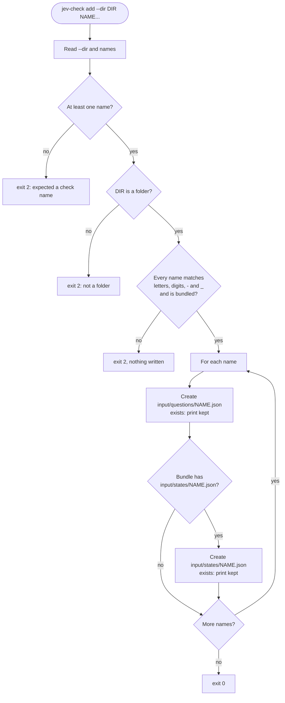

### list

`jev-check list [DIR]` shows the checks available in the project, which of them the gate runs, then the bundled checks the project does not have. It reads `DIR/.jev-check/input/` and `project-context.json`, and calls no API.

1. `DIR` (default: the current folder) must be a folder.
2. Reads `DIR/.jev-check/input/questions/`. A missing folder means the project has no checks, not an error.
3. Reads `project-context.json`. When it is missing or invalid, `list` still runs, but it cannot say which checks the gate runs.
4. For each `.json` file, it checks the name, reads the questions and the optional default state, and requires a non-empty `questions` object. Files that do not end in `.json` are skipped.
5. Prints each project check with a tag, then its title and description. The tag is `project`, then `gate <threshold>` when `checks` lists it or `not in checks` when it does not (left out without a readable config), then `has default state` or `needs --file`. For example: `example [project, not in checks, has default state]`.
6. Prints each bundled check the project lacks as `<name> [bundled, not added: jev-check add <name>]`.

Exit 0, or 2 when a check file has a bad name or invalid JSON.

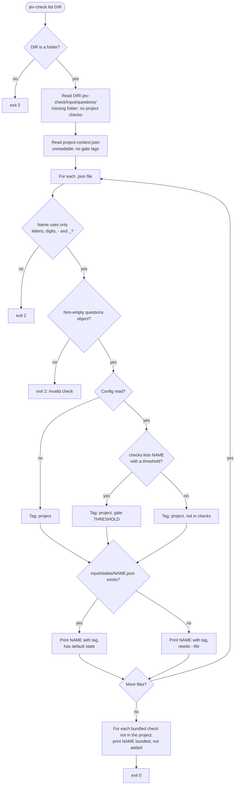

### ask

`jev-check ask <check> [state.json] [--file PATH]... [--threshold N] [--model ID] [--dry-run]` sends one check to Jev with any state you give it. It uses the current folder as the project, and does not need a Git repository.

1. Reads the options. `--threshold` must be from 0 to 1, and `--model` must not be empty. It takes one or two positional arguments: the check and an optional state file.
2. Loads the settings from `./.jev-check/.env`: key, endpoint, and model. Inside a Git repository, a tracked `.env` is exit 2. A bad endpoint is exit 2, even with `--dry-run`.
3. Loads the check. A first argument ending in `.json` is read as a path. Anything else is a check name, read from `./.jev-check/input/questions/<name>.json`. A missing bundled check is an error that names the `jev-check add` command to run.
4. Builds the state from the state file, else the check's default state. With neither, `--file` is required.
5. Adds each `--file PATH` to the state as `files[PATH] = <content>`.
6. Scans the whole request for secrets. A finding prints `SECRET` lines, sends and saves nothing, and exits 1.
7. With `--dry-run`, prints the request as JSON and exits 0. No key is needed.
8. Otherwise it posts the request with the key as a Bearer token. The client has a 120 second timeout and follows no redirects. A missing key, a non-2xx status, or an answer that does not match the questions is exit 2.
9. Saves the request and the raw response to `./.jev-check/output/<timestamp>-<check>-<random>.json`.
10. Prints one line per yes/no answer, then `info` lines for choice and score answers, then `model: <model>  saved: <path>`.

Exit 1 when `--threshold` is set and any yes/no answer is below it. Otherwise exit 0, even for low answers. `ask` never uses the cache.

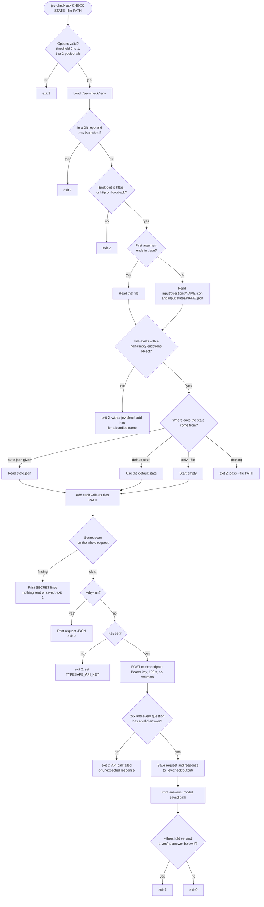

### context

`jev-check context [DIR]` prints the shared state that `gate` and `eval` send with every patch. It reads no settings, validates no checks, and calls no API.

1. Reads `DIR/.jev-check/project-context.json` (default `DIR`: the current folder). If only an old root `project-context.json` exists, it exits 2 with the move steps.
2. Reads each `coding_style` document the checks name. The path must stay inside the project with no `..`, absolute path, or symlink. The file must be regular UTF-8 text, not empty, without NUL bytes, and at most 65,536 bytes.
3. Scans those documents for secrets. A finding is exit 1.
4. Lists the tree with `git ls-files -z --cached --others --exclude-standard -- .`, minus every `exclude` pathspec. Tracked and untracked files both appear. Files that `.gitignore` ignores do not.
5. Prints JSON with `project` (`purpose`, `rules`, `folders`), `tree`, and, when a check has a `coding_style`, `coding_styles` mapping each path to its contents once.

It scans only the `coding_style` documents. The project fields and the tree are printed without a scan; `gate` scans them before it sends anything. Exit 0, 1 for a secret in a document, 2 for any other error.

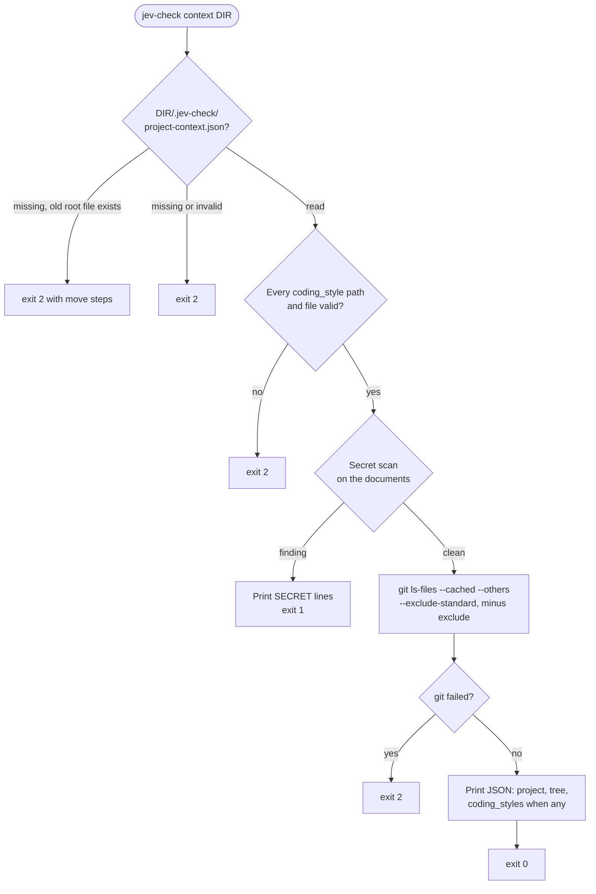

### secrets

`jev-check secrets PATCH...` runs the local secret scan alone on one or more files. It needs no project, no Git, and no settings.

1. Requires at least one path.
2. Reads each file. A read error stops the command with exit 2; lines already printed stay printed.
3. Checks every line against the secret patterns: private key headers, cloud and provider token formats, JWTs, credentials in URLs, Bearer literals, and quoted or `.env`-style assignments to names such as `password` or `token`. It also checks each line with one leading `+`, `-`, or space removed, so removed and context lines of a patch count.
4. Prints one line per kind of secret found: `SECRET  <file> line N,M looks like <kind>`. It never prints the value. A file name that itself looks like a secret, or holds a control character, prints as `patch`.

Exit 0 when every file is clean, 1 when anything looks like a secret, 2 on an error. This is the line scan only. `ask`, `gate`, and `eval` also scan every JSON key and value of a request, and each key and value as a pair.

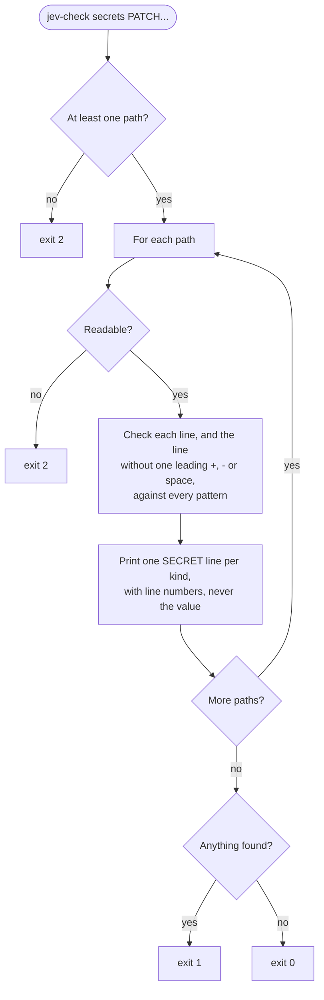

### judge

`jev-check judge OUTPUT.json THRESHOLD [QUESTION=THRESHOLD]...` judges a saved answer again with new thresholds. It reads one file that `ask` or `gate` saved in `.jev-check/output/`, and calls no API.

1. Requires the file and a threshold.
2. Reads the saved `request` and `response`. Invalid JSON is exit 2.
3. Checks the answers against the saved questions: every question has an answer of its type, there are no extra answers, and each yes/no answer is a number from 0 to 1. A bad answer is exit 2.
4. Reads `THRESHOLD`, from 0 to 1.
5. Reads each `QUESTION=THRESHOLD`. The question must be in the answers, and the value must be from 0 to 1. It overrides the default threshold for that question.
6. Prints `ok` or `FAIL`, the probability, and the question for each yes/no answer, then `info` lines for choice and score answers.

Exit 1 when any yes/no answer is below its threshold, 0 when none is, 2 on an error.

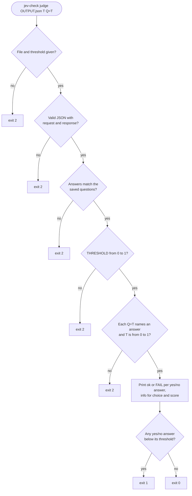

### gate

`jev-check gate [DIR] [--no-cache] [--model ID]` sends one patch per staged file to every check in `DIR/.jev-check/project-context.json`, and prints `gate: PASS`, `gate: FAIL`, or `gate: ERROR`. See [Gate](#gate) for the configuration and [Cache](#cache) for the cache rules.

1. Loads the settings from `DIR/.jev-check/.env`. A tracked `.env` or a bad endpoint is exit 2. The key is needed only when a request misses the cache.
2. Reads `project-context.json` and checks every entry of `checks` before any request: a valid name, a threshold from 0 to 1, a question file in `.jev-check/input/questions/`, and `per_question` entries that name real questions with values from 0 to 1. Any problem is exit 2.
3. Reads the `coding_style` documents and lists the tree, as `context` does.
4. Scans the shared content: the model, the project fields, the tree, and the `coding_style` documents. A finding prints it with `gate: FAIL` and exits 1 before any request.
5. Scans each check's questions. A finding prints `== <check> questions` with the report and skips that check. The other checks still run.
6. Lists the staged files with `git diff --cached --relative --name-only`, minus `exclude`. With no staged file and no finding so far, it prints `nothing staged` and exits 0.
7. Gets each file's staged patch with `git diff --cached --relative -- <file>`. It scans every line of it, including removed and context lines. A finding prints `SECRET` lines and skips that file. The other files still run.
8. For each check, lists the staged files again minus `exclude` and the check's `skip`. For each file with a clean patch, it builds a request: model, questions, and the shared state plus `files: {"<file>.patch": <patch>}`, plus the check's own `coding_style`.
9. Looks in the cache, unless `--no-cache`. A hit needs the same key, format version 2, an age under 24 hours, and valid answers. On a miss it calls the API as `ask` does, saves the exchange in `.jev-check/output/`, and writes the cache entry through a temporary file and a rename. A failed cache write only warns on stderr.
10. Prints `== <check> <file>`, with `(cached)` for a hit, then each answer against the check's threshold and `per_question`. An API error prints the header, the message on stderr, and moves on to the next file.
11. Prints the worst result: `gate: PASS` (0), `gate: FAIL` (1, a failed answer or a secret), or `gate: ERROR` (2, an API error).

A file name that looks like a secret, or holds a control character, prints as `staged file N`.

```mermaid
flowchart TD
    s(["jev-check gate DIR"]) --> set{"Settings OK?<br/>.env not tracked,<br/>endpoint valid"}
    set -- "no" --> e1["exit 2"]
    set -- "yes" --> cfg{"project-context.json read<br/>and every check valid?"}
    cfg -- "no" --> e2["exit 2"]
    cfg -- "yes" --> shared["Read coding_style documents<br/>git ls-files for the tree"]
    shared --> scan1{"Secret in model, project fields,<br/>tree, or documents?"}
    scan1 -- "yes" --> f0["Print findings, gate: FAIL<br/>exit 1, nothing sent"]
    scan1 -- "no" --> scan2["Scan each check's questions<br/>finding: skip that check, status 1"]
    scan2 --> staged["git diff --cached --name-only<br/>minus exclude"]
    staged --> none{"No staged file<br/>and status 0?"}
    none -- "yes" --> ns["nothing staged<br/>exit 0"]
    none -- "no" --> patches["For each file:<br/>git diff --cached -- FILE"]
    patches --> scan3{"Secret in the patch?"}
    scan3 -- "yes" --> skipf["Print SECRET lines,<br/>skip the file, status 1"]
    scan3 -- "no" --> keep["Keep the patch"]
    skipf --> morefiles{"More staged files?"}
    keep --> morefiles
    morefiles -- "yes" --> patches
    morefiles -- "no" --> checks["For each check not skipped,<br/>each staged file not in its skip list"]
    checks --> req["Request: model, questions,<br/>project, tree, FILE.patch,<br/>the check's coding_style"]
    req --> cache{"--no-cache not set and a<br/>fresh, valid cache entry?"}
    cache -- "yes" --> hit["Use cached answers"]
    cache -- "no" --> callApi["Call the API, save to output/,<br/>write the cache entry"]
    callApi --> apiok{"Call succeeded?"}
    apiok -- "no" --> apierr["Print the header, error on stderr<br/>status 2"]
    apiok -- "yes" --> verdict
    hit --> verdict["Print == CHECK FILE,<br/>ok or FAIL per answer"]
    verdict --> fail{"Any answer below<br/>its threshold?"}
    fail -- "yes" --> st1["status at least 1"]
    fail -- "no" --> next
    st1 --> next{"More checks or files?"}
    apierr --> next
    next -- "yes" --> checks
    next -- "no" --> result["gate: PASS, FAIL, or ERROR<br/>exit 0, 1, or 2"]
```

### eval

`jev-check eval <check> [DIR] [--no-cache] [--model ID]` tests a check's thresholds on its fixtures in `DIR/.jev-check/fixtures/<check>/`. See [Fixtures and eval](#fixtures-and-eval) for the folder layout.

1. Loads the settings and `project-context.json`, as `gate` does. The check must be in `checks`, and its entry must be valid.
2. Collects the check's yes/no (`noul`) questions. A check without one is exit 2, because nothing has a threshold.
3. Reads the `coding_style` document, if any, and lists the tree.
4. Finds the fixtures: `pass/*.patch`, and `fail/<question>/*.patch` for each yes/no question. It exits 2 when a `.patch` sits directly in `fail/`, when a fail folder names no yes/no question, when a fixture is not a regular file, or when `pass/` or any `fail/<question>/` is empty. It names every missing set at once.
5. Reads and parses every fixture before any request. Each must be one single-file text patch from Git, with LF line endings and hunks that match their `@@` counts. It takes the path from the headers: the new path, the old path of a deletion, or the `rename to` path. It refuses unsafe paths. Any problem is exit 2.
6. Scans every request, or the `coding_style` document once. Any finding prints `eval: BLOCKED` and exits 1 with nothing sent.
7. Sends each fixture through the same cache as `gate`. Any API error stops the command with exit 2.
8. Counts misses. A pass fixture misses once for each yes/no question below its threshold. A fail fixture misses when its own question is at or above its threshold. Each miss prints a `MISS` line.
9. Prints the fixture counts per question, then the lowest pass score, the highest fail score, and the threshold per question, then `eval: N misses in M fixtures`.

Exit 0 with no misses, 1 with a miss or a secret, 2 on a usage, fixture, or API error.

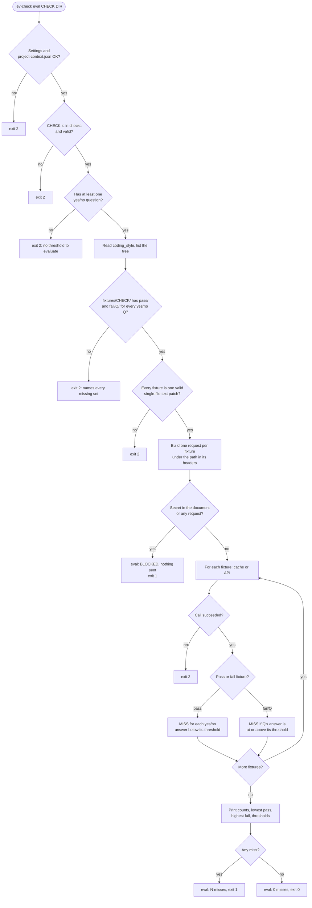

### doctor

`jev-check doctor [DIR]` prints the settings jev-check would use for `DIR` and every setup problem it can find offline. It never calls the API and never prints the key. It prints one `ok` or `FAIL` line per item:

1. `settings file`: the path of `DIR/.jev-check/.env`, with `missing` when it does not exist. It fails when Git tracks the file or Git cannot tell.
2. `endpoint` and `model`: each value, with its source, either the settings file or `default`. The endpoint fails when it is not https, or http on loopback. When the settings file failed, these lines and the key line fail as `not read`.
3. `API key`: `set`, or `FAIL` with where to put it. An extra `info` line says when `TYPESAFE_API_KEY` is in the environment, which jev-check ignores.
4. `project`: `project-context.json` reads, every check in it is valid, and every `coding_style` document is valid.
5. `old layout`: shown only when both `DIR/project-context.json` and `DIR/.jev-check/project-context.json` exist, as a `FAIL`.
6. `git and output`: `DIR` is in a Git working tree, and it can create and delete a probe file in `.jev-check/output/`, or in `.jev-check/` when `output/` does not exist yet.

It ends with `doctor: ok` or `doctor: FAIL`, and the note that the key and the service were not tested. Exit 0 when every line is `ok`, 2 when any line fails. When the model looks like a secret, it prints the finding and exits 1 at once.

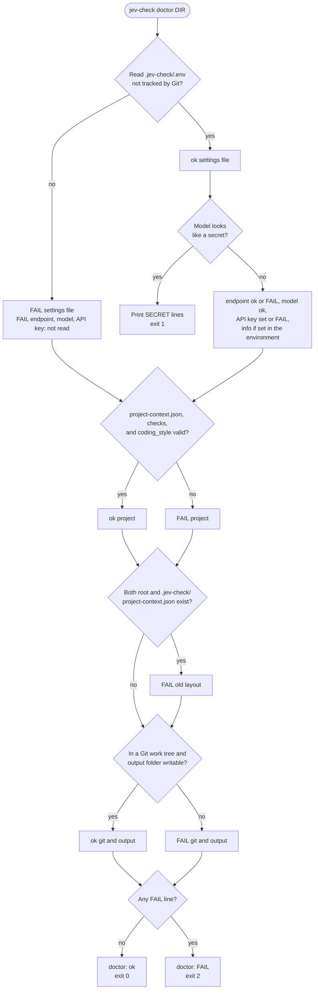

## Layout

- `ask.go` holds `list` and `ask`, and reads a project's checks.
- `bundle.go` embeds the bundled checks and the folder guide, and holds `add`.
- `install.sh` installs a release binary. [`.github/workflows/release.yml`](.github/workflows/release.yml) builds the binaries when a `v*` tag is pushed.
- `context.go` builds the project state from `.jev-check/project-context.json` and the file tree, and holds `init`.
- `secrets.go` scans patches and whole requests for secrets locally, before anything is sent.
- `judge.go` applies thresholds to answers.
- `gate.go` runs the checks on one patch per staged file, with a cache.
- `eval.go` tests a check's thresholds on its fixtures.
- `settings.go` reads `.jev-check/.env` and holds `doctor`.
- `main_test.go` and the other `*_test.go` files test every command offline with a fake Jev server. Run `go test ./...`.
- `.jev-check-example/project-context.json` is this repository's configuration.
- `.jev-check-example/input/questions/<name>.json` holds one check. `.jev-check-example/input/states/<name>.json` is an optional default state for it. Both are built into the binary, for `init` and `add` to copy.
- `.jev-check-example/README.md` is the guide that `init` writes to `.jev-check/README.md`.
- `.jev-check-example/fixtures/<check>/` holds the patches that prove a check's threshold.
- `CODING_STYLE.md` holds this repository's coding rules, for people and the `coding-style` check.

## License

MIT. See `LICENSE`.
